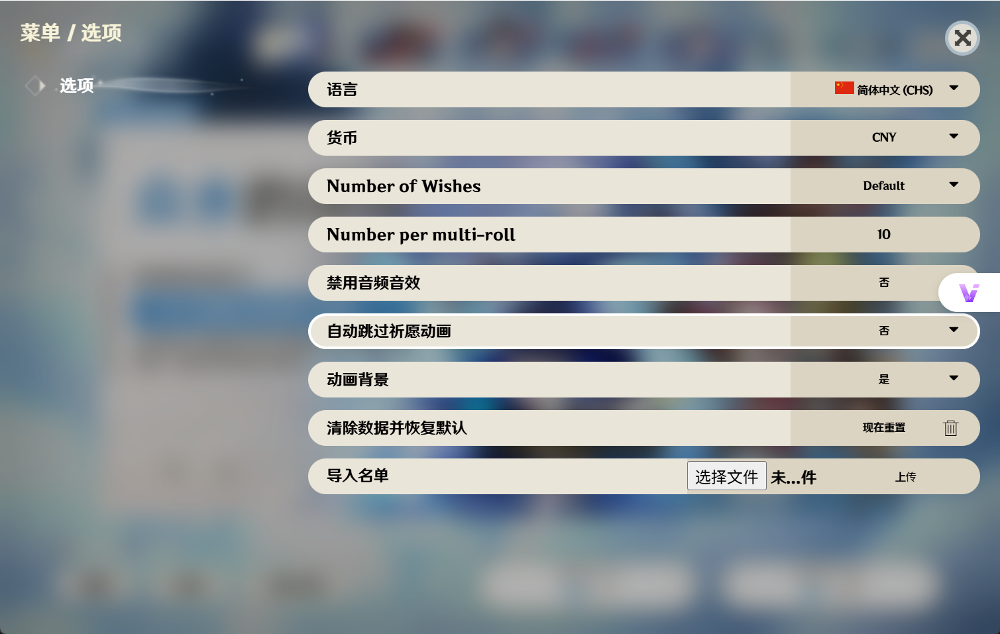

# 📥 安装

## 📦 获取主程序

你可以在 [Release](https://github.com/CynaraGroup/GenishImpact_Picker/releases) 页面获取最新版本的主程序。

## 🔧 解压文件

将压缩包内**全部**文件解压到任意文件夹内，并牢记其位置

## 🚀 运行程序

双击程序图标，即可启动应用

## 📋 导入名单

1. 点击左上角「？」按钮
   

2. 在弹出菜单中选择「导入文件」选项
   

3. 浏览并选择名单文件，点击「上传」确认
   

## 🎯 点名功能

返回首页后，点击「祈愿×1」按钮开始随机点名

::: warning ⚠️
当前仅第一个卡池「众水的颂诗」支持点名功能，其他卡池为原始抽卡玩法模式
:::