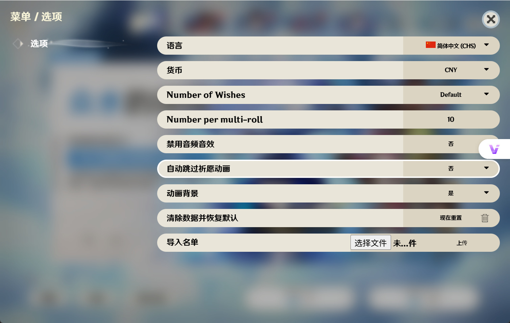
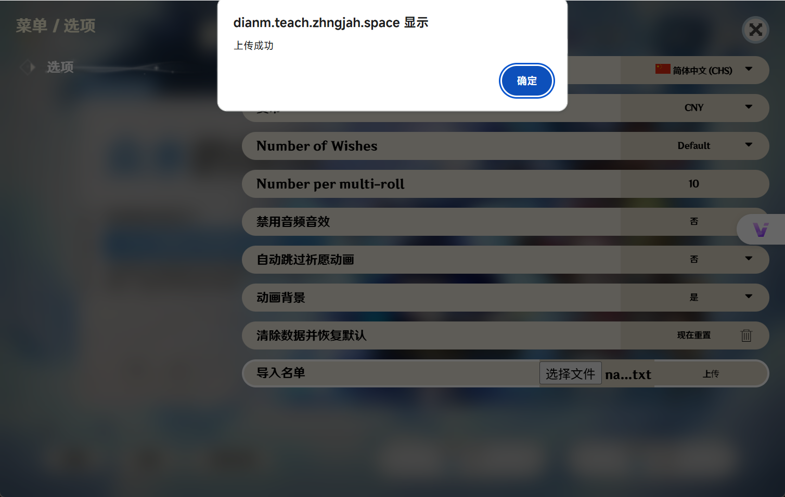

# 🌐 在线使用

## 🖥️ 打开网页

在浏览器中访问以下地址：
[https://dianm.teach.zhngjah.space/](https://dianm.teach.zhngjah.space/)

## 📋 导入名单流程

1. 点击页面左上角「？」按钮
   

2. 在弹出菜单中选择「导入文件」选项
   

3. 浏览并选择本地名单文件，点击「上传」按钮确认
   

## 🎯 点名功能使用

返回首页后，点击「祈愿×1」按钮开始随机点名

::: warning
当前仅第一个卡池「众水的颂诗」支持点名功能，其他卡池为原始抽卡玩法模式
:::