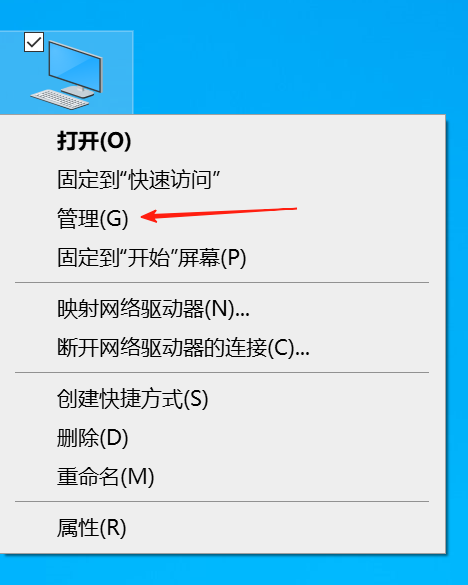
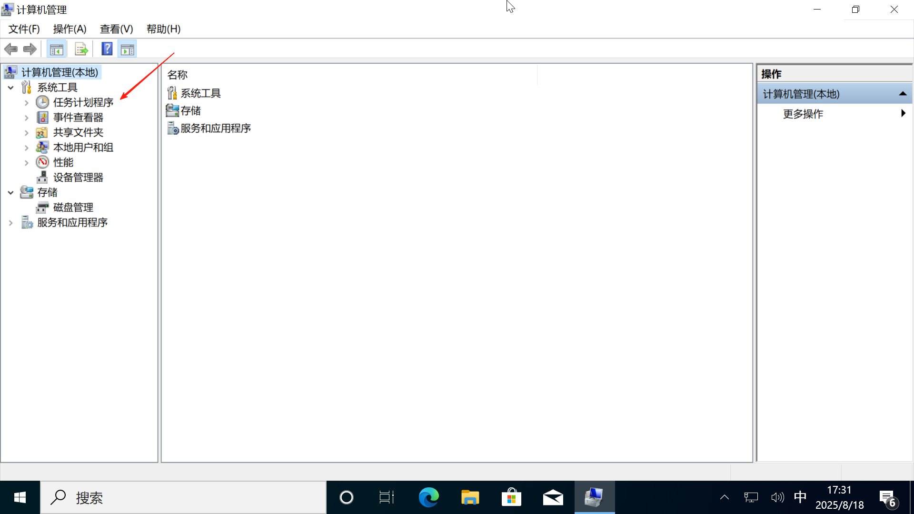
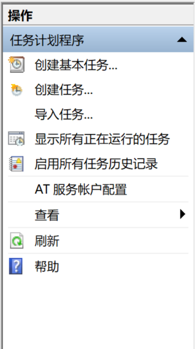
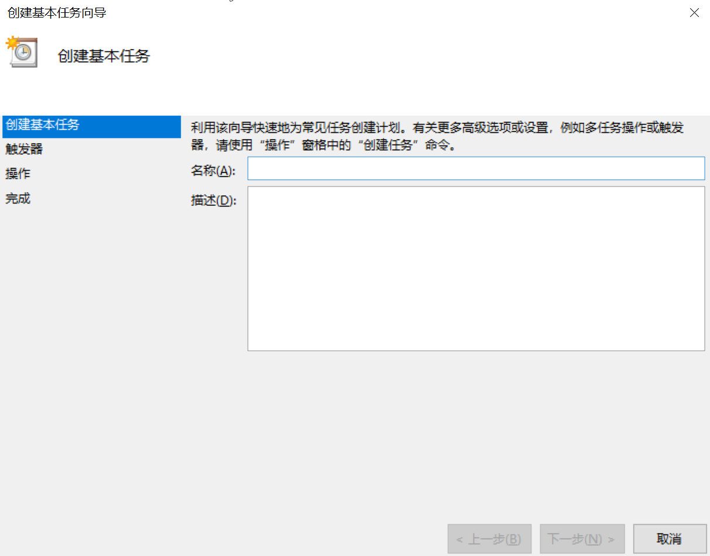
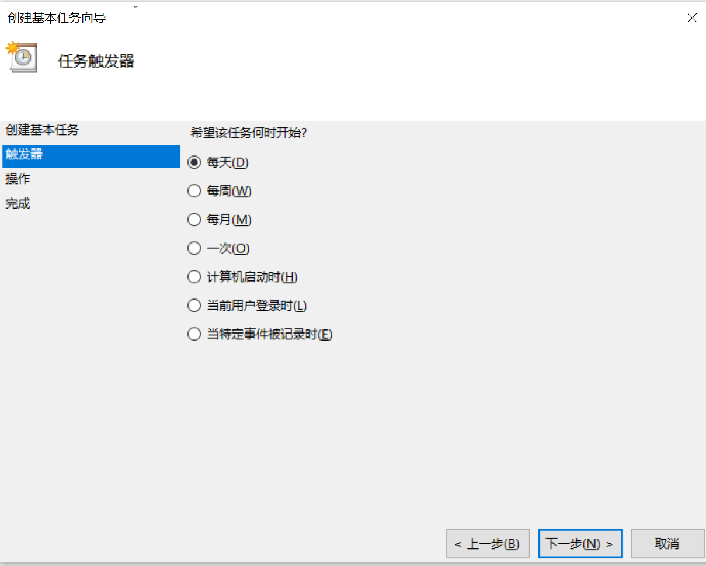
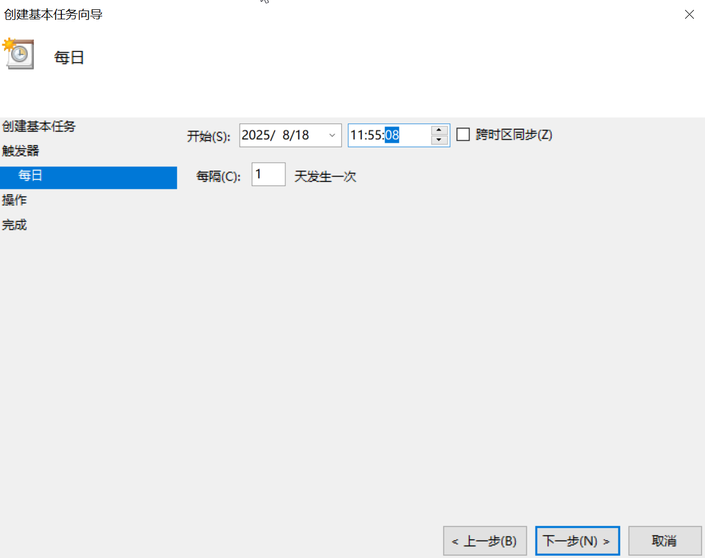
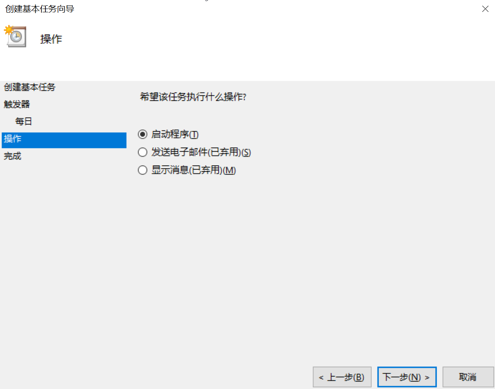
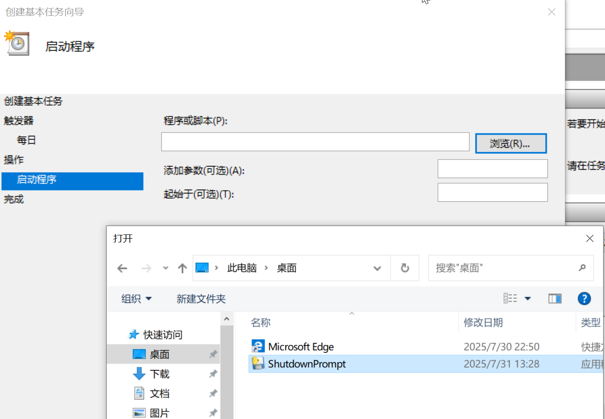
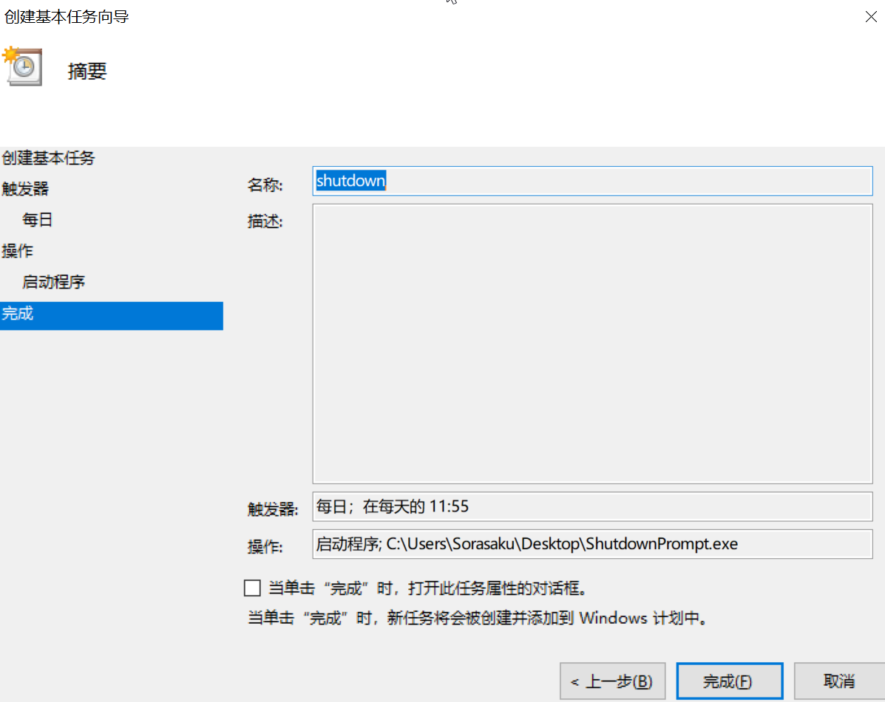

# 📥 安装

## 📦 获取主程序

你可以在 [Release](https://github.com/CynaraGroup/Shutdown_Prompt/releases) 页面获取最新版本的主程序。

## 🔧 解压

将压缩包内**全部**文件解压到任意文件夹内，并牢记其位置

## 📅 部署计划任务

按照以下步骤部署计划任务：

1. **在桌面“此电脑”右键“管理”**
   

2. **点击左侧“任务计划程序”**
   

3. **点击“创建基本任务”**
   

4. **输入名称和描述，点击“下一步”**
   

5. **触发器选择默认“每天”，点击“下一步”**
   

6. **输入详细的运行时间，建议增加8秒，点击“下一步”**
   > 按照无线电平均延迟，打铃时间应该比标准时间晚8秒
   

7. **操作默认启动程序，点击“下一步”**
   

8. **点击“浏览”，选择程序，点击“下一步”**
   

9. **点击完成**
   